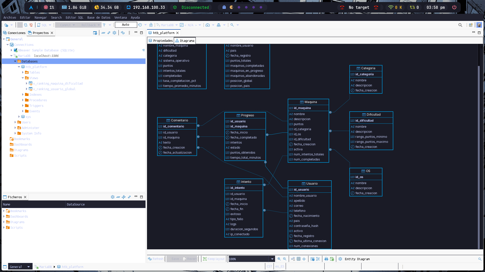
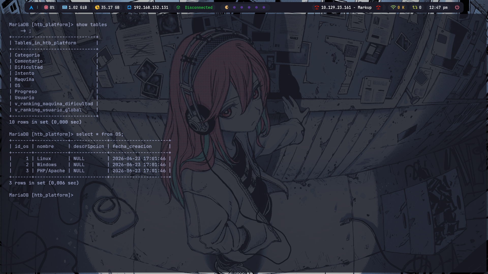
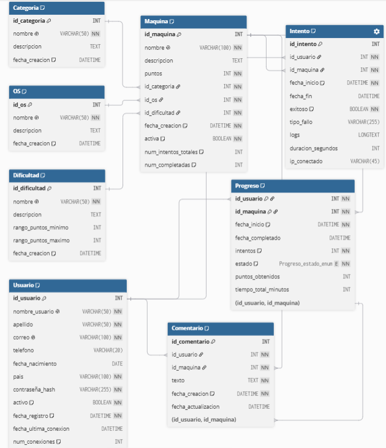

# HTB Platform Database (UNAM SQL Project)

> Relational database project developed as part of the UNAM Cisco Database course.

## Overview

This project consists of the design and implementation of a relational database inspired by platforms such as **Hack The Box**, where users can solve vulnerable machines, track their progress, and compete through rankings.

The schema follows **Third Normal Form (3NF)** to minimize redundancy while maintaining referential integrity and scalability.

<h2 align="center">Entity Relationship Diagram</h2>

<p align="center">
  
</p>

<p align="center">
  
</p>

<p align="center">
  
</p>

## Features

* 8 normalized relational tables
* 2 analytical SQL views
* Primary Keys and Foreign Keys
* Composite Primary Keys
* Index optimization
* Referential integrity constraints
* Ranking system using SQL Views
* MySQL / MariaDB compatible

## Database Structure

```
HTB Platform
│
├── Categoria
├── OS
├── Dificultad
├── Usuario
├── Maquina
├── Progreso
├── Intento
├── Comentario
│
├── v_ranking_usuario_global
└── v_ranking_maquina_dificultad
```

## Technologies

* SQL
* MySQL
* MariaDB

## Repository Structure

```
.
├── README.md
└── schema.sql
```

## Learning Objectives

This project was created to practice:

* Database normalization (3NF)
* Relational modeling
* SQL DDL
* Foreign Keys
* Composite Keys
* Views
* Indexes
* Database design principles

## Documentation

A complete explanation of the database design, normalization process, table relationships, indexes, constraints, and analytical views is included in the project documentation.

-- Nitblan :)
